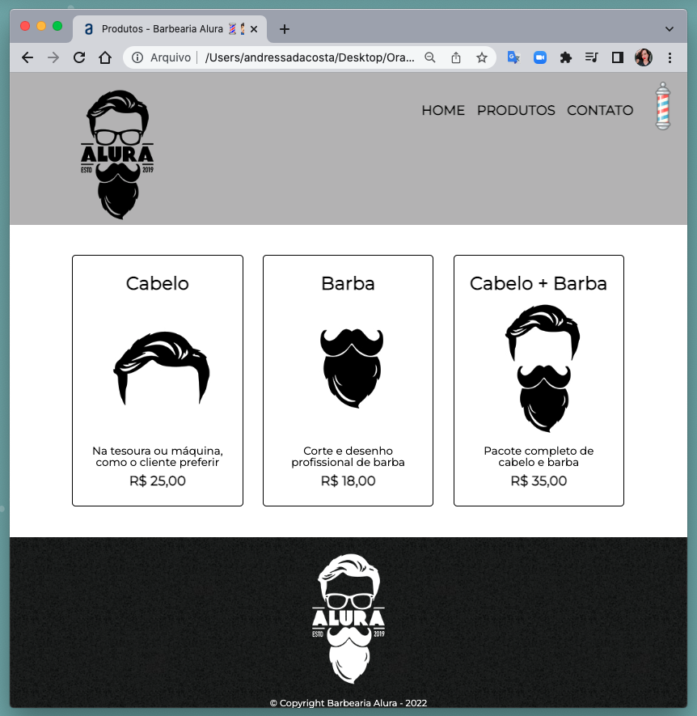

# Alura + Oracle ONE 👩🏻‍💻<br><br> []("linkedin.com/in/andressa-costa-286173225/") [](linkedin.com/in/andressa-costa-286173225/)   [](https://github.com/AndressaDaCosta)


## Site Barbearia Alura

Projeto final do curso de HTML e CSS da Alura + Oracle(ONE).

 >assunto(s): ```html``` | ```css``` |


### Aprendizado:

- Construção completa de uma página utilizando HTML e CSS.
- Utilização de API's.
- Semântica e código limpo no CSS.
- Pós processamento CSS
- Criação de sites acessíveis a pessoas com baixa visão.
- Criação de códigos de fácil manutenção. 
- Resolução de conflitos de estilos.
- Algumas práticas pra ter um design responsivo.


Obrigado Professor Pedro Marins pela didática incrível!


## Resultado do projeto:

[📁 Repositório](https://github.com/AndressaDaCosta/barbearia_alura) |  [🌎 Página](https://andressadacosta.github.io/barbearia_alura/index.html)


## Visualização


